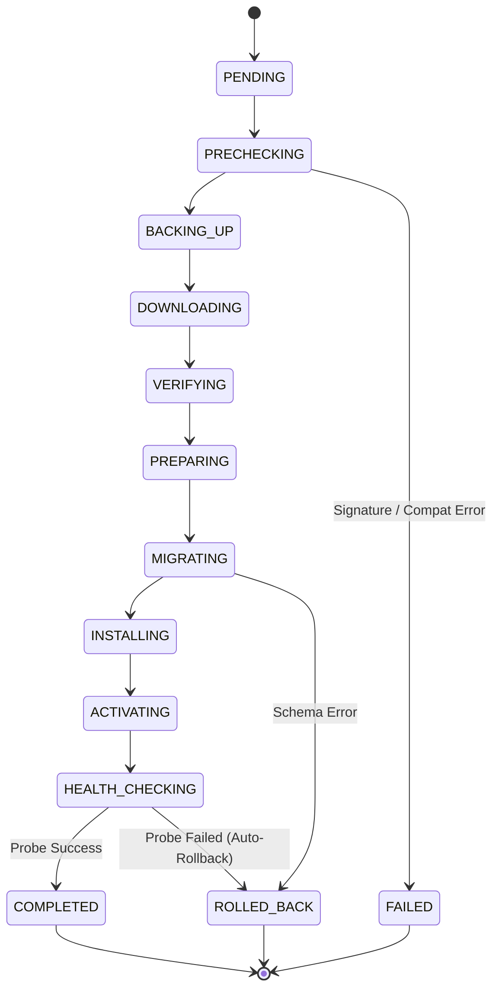

# Hostvra Live Update & Upgrade System

This document outlines the architecture, release security, deployment pipeline, and operational procedures for the **Hostvra Live Update System**.

---

## 1. Core Architecture

The Hostvra Live Update System guarantees:
- **Zero or minimal customer downtime**: Web servers (Nginx, Apache, OpenLiteSpeed), databases, mailboxes, and DNS are completely decoupled from control plane updates and run uninterrupted.
- **Data safety first**: Automatic pre-update cryptographic snapshots of `/etc/hostvra` and `/var/lib/hostvra` are verified before any changes are made.
- **Cryptographic integrity**: Every release tarball is verified against Ed25519 digital signatures and SHA-256 digests before decompression.
- **Atomic filesystem cutover**: Deployments stage into versioned `/opt/hostvra/releases/<version>/` directories; cutover happens instantaneously via a POSIX-atomic symlink swap to `/opt/hostvra/current`.
- **Automated health probes & instant rollback**: If post-update HTTP health checks fail, the atomic symlink is immediately reverted to the previous release with zero data loss.

---

## 2. Directory Layout

```text
/opt/hostvra/
├── current -> /opt/hostvra/releases/1.1.0/
├── releases/
│   ├── 1.0.0/
│   │   ├── bin/hostvra-api
│   │   ├── migrations/
│   │   └── web/
│   └── 1.1.0/
│       ├── bin/hostvra-api
│       ├── migrations/
│       └── web/
└── updates_backup/
    ├── snapshot_1.0.0_1725612345.tar.gz
    └── snapshot_1.0.0_1725612345.sha256

/etc/hostvra/
├── api.env
└── security_keyring.pub

/var/lib/hostvra/
└── backups/
```

---

## 3. Deployment State Machine

An update transitions sequentially through 12 discrete states:



---

## 4. REST API Endpoints

All update endpoints require `system.updates.*` RBAC permissions:

| Method | Path | Required Permission | Description |
|---|---|---|---|
| `GET` | `/api/v1/system/updates/status` | `system.updates.view` | Current versions, latest available release, and active job |
| `GET` | `/api/v1/system/updates/check` | `system.updates.check` | Polls remote update server for fresh release metadata |
| `POST` | `/api/v1/system/updates/start` | `system.updates.start` | Initiates background live update pipeline |
| `GET` | `/api/v1/system/updates/jobs` | `system.updates.view` | Returns historical update and rollback logs |
| `GET` | `/api/v1/system/updates/jobs/{id}` | `system.updates.view` | Granular step logs and progress percentage |
| `POST` | `/api/v1/system/updates/rollback` | `system.updates.rollback` | Reverts active installation to previous stable snapshot |
| `POST` | `/api/v1/system/updates/channel` | `system.updates.manage` | Switches release channel (`stable`, `beta`, `nightly`) |
| `POST` | `/api/v1/system/updates/schedule` | `system.updates.schedule` | Configures unattended maintenance window cron |

---

## 5. CLI Reference (`hostvra`)

The `hostvra` command-line utility provides terminal access to all update operations:

```bash
# Check for updates
hostvra update check

# View system versions and active update status
hostvra update status

# Run live update with terminal progress display
hostvra update install --target=1.1.0 --channel=stable -y

# Emergency rollback
hostvra update rollback -y

# View update history
hostvra update history

# Switch release channel
hostvra update channel beta
```

---

## 6. Security Guarantees

1. **Ed25519 Cryptography**: Releases must be signed by the official Hostvra Private Key. Packages with invalid or missing signatures are rejected at the `VERIFYING` stage.
2. **Downgrade Protection**: Attempting to install a version with a lower SemVer than the current installation requires explicit administrative override.
3. **Path Traversal Protection**: Archive tarballs are strictly verified to ensure no entries escape `/opt/hostvra/releases/<version>/`.
4. **Isolated Service Sandboxing**: The `hostvra-api` service runs under systemd `ProtectSystem=strict` with non-root UID `hostvra`.
